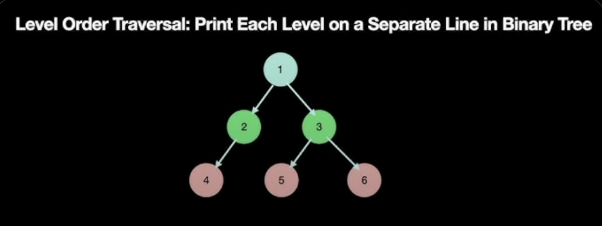

# LeetCode Interview Exercises Repository

This repository contains a collection of solutions to LeetCode exercises, categorized by difficulty level. The exercises are designed to help prepare for technical interviews, particularly those focused on algorithms and data structures.

The repository is divided into three main sections:

### Hard

This section includes solutions to the most challenging LeetCode exercises, requiring advanced problem-solving skills and a deep understanding of algorithms and data structures.

### Medium

This section contains solutions to exercises of moderate difficulty, suitable for those with a solid foundation in algorithms and data structures.

### Easy

This section includes solutions to the least challenging LeetCode exercises, ideal for beginners or those looking to refresh their understanding of basic algorithms and data structures.

### Others

This section may include additional resources, such as diagrams or explanations, to supplement the exercise solutions. For example, the binary tree diagram below illustrates a common data structure used in many LeetCode exercises.

By working through these exercises and studying the solutions provided, you can improve your problem-solving skills, prepare for technical interviews, and enhance your understanding of algorithms and data structures.
